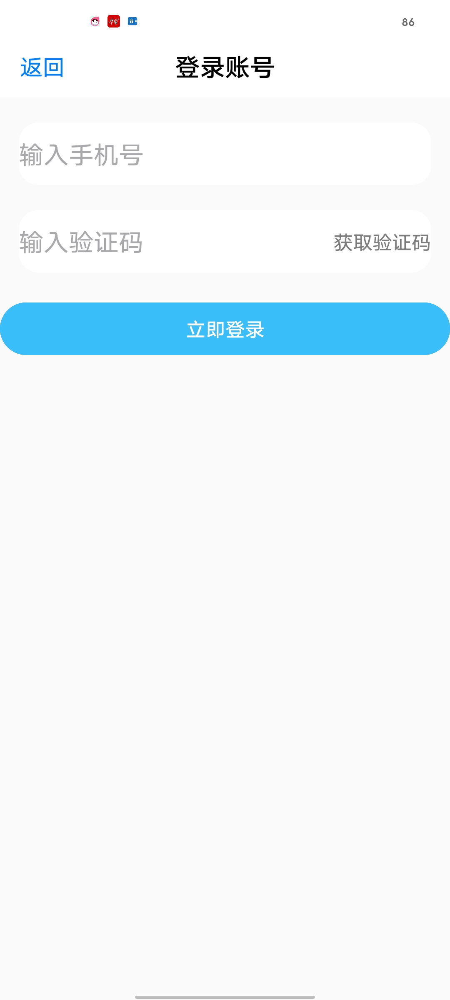

# 小米实践训练营-项目实践

[weibo_sdulearner.apk](./app/debug/app-debug.apk)

**项目结构**

**最终效果演示**

[演示视频](./videos/video_20240626_201113_edit.mp4)

**课程培训地址**

[课程培训地址](https://github.com/sdulearner/sdulearner_xiaomi)

# Day16(20:00之前)

1. **调整HelloFragment(声明与条款弹窗)的视觉效果**

2. **优化视频的显示效果(未播放和暂停时显示视频图标，暂停时隐藏时间文字)**

3. **优化登录页面的布局显示**

   

   

# Day16(17:00之前)

### token过期问题

1. - [x] 所有接⼝请求报403时，删除本地token，将登陆状态改为未登录并且跳转到登录页面  

### 首页

1. - [x] 点击删除按钮，删除当前Item，仅更新本地数据；下拉刷新后，数据继续显示

1. - [x] 点击评论按钮：弹出Toast：点击第N条数据评论按钮

2. - [x] 点赞：点赞和取消点赞动画，网络请求成功后更新本地数据状态和UI；点赞和取消点赞必须登录，没有登录跳转到登录页面；

    - [x] 参考今日头条点赞效果，略有简化
    - [x] 点赞动画：图标由1.0放大到1.2倍，然后回到1.0倍，于此同时图标沿Y轴旋转360度；持续时间1000ms
    - [x] 取消点赞动画：图标由1.0缩小到0.8倍，然后回到1.0倍，持续时间1000ms

3. - [x] 点击图片：跳转到大图浏览页，点击当前图片跳转过去后当前页要对应，例如：点击第三张图片，大图浏览页显示第三张，同时当前页面index=3；

**效果演示**（文件有点大可能得等会儿加载出来）

### 大图浏览页

1. - [x] 仅显示用户头像、昵称、当前页数/总图片数、下载按钮
2. - [x] 页面全屏显示，隐藏顶部状态栏和底部导航栏；页面要求渐入渐出，效果自然
3. - [x] 图片以宽度为基础，高度自适应；高度小于屏幕高度则上下居中
4. - [x] 可左右滑动，左右滑动时当前页数更新；
5. - [x] 点击屏幕页面关闭，返回首页
6. - [x] 点击下载：图片下载后保存到相册中，后台下载即可，下载完成弹出的Toast：图片下载完成，请相册查看

**效果演示**（文件有点大可能得等会儿加载出来）

### 项目整体联调

1. - [x] 检查设计稿还原度：
     - [x] 更换图标
     - [x] 调整了视频进度条的样式
     - [x] 调整顶部状态栏的颜色和Activity的背景色
2. - [x] 未登录和已登录首页均可正常显示
3. - [x] 完善业务逻辑和边界，确保不发生崩溃
4. 功能联调完成后，进行布局优化，优化后单独提交
5. 功能联调完成后，检测内存泄漏并进行优化，优化后单独提交

# Day15补做

[weibo_sdulearner.apk](./app/debug/app-debug.apk)

### 首页loading页和网络错误页面

9. - [x] 第一次打开app，第一次进入首页显示加载中，网络数据请求成功后，后续再次下拉刷新均不再展示加载中页面；
   - [x] 下拉刷新请求数据失败时：
     - [x] 本地没有缓存数据，显示网络请求失败页面，点击重试按钮，触发页面刷新，显示加载中，网络请求成功后显示列表页；网络请求失败，继续显示网络请求失败页面；
     - [x] 本地存在缓存数据，则使用缓存数据展示列表，同时顶部显示当前无网络提示信息；
     - [x] 监听本地网络变化，当网络状态从无网状态-->有网状态，重新刷新数据；

**效果演示**

### 首页

1. 首页界面帖子包含以下元素：头像、用户名称、删除按钮、帖子标题、视频或者图片、评论、点赞；

2. 首页支持下拉刷新和上拉加载更多：

   下拉刷新：每次请求成功后，将数据顺序随机打乱，模拟数据更新；

   上拉加载没有新数据时，弹出Toast：无更多内容；

   - [x] 每次下拉刷新请求成功后，将数据缓存到本地；

3. 帖子标题：普通文本，最多显示6行，超过显示“...”；

4. 图片模块：单张图和大图显示、大图尺寸可固定；多张图片使用9宫格即可

   - [x] **单张图的宽高使用Glide动态获取，根据宽高，显示横图样式，否则显示竖图样式；**

1. 视频模块：

   视频默认不自动播放，点击视频播放，只有进度条，不可拖拽；视频划出屏幕后，自动暂停； 

   视频设置循环播放，视频没有声音；

   - [x] **视频显示规则：默认显示横图样式；主要代码如上图所示**

   视频功能使用MediaPlayer实现，视频播放之前仅显示封面图，暂停状态：点击视频开始播放；

   进度条更新随视频播放进度不断更新，通过视频当前播放时间和总时间，动态更新进度条进度；

   更新视频播放时长；

2. 视频模块和图片模块判断：优先判断videoUrl字段不为空，则视频模块；images不为空，则图片模块；均为空，则是普通文本；

3. - [x] 登录成功后，刷新首页数据；

   **实现效果展示**

   

1. - [x] 未登录和已登录首页均可正常显示；

# Day14

[Day14演示视频](./videos/Screenrecording_20240614_170749.mp4)

**首页loading页和网络错误页面未实现** 

# Day13晚补做

1. HelloFragment弹窗中ClickableSpan富文本（《用户协议》、《隐私政策》）字体改为蓝色，并且点击不会变深；
   为同意和不同意的按钮设置了按下改变颜色

2. 更新了顶部ToolBar的显示效果

3. 增加了退出登录按钮，只有在登录状态时才显示；优化了“我的”界面的逻辑

4. 优化了登录的逻辑，登陆成功会用EventBus更新“我的”界面并自动返回

5. 发送验证码实现点击后60s倒计时

   [倒计时演示视频](./videos/Screenrecording_20240614_165736.mp4)

# Day13

**60s倒计时功能未实现**

